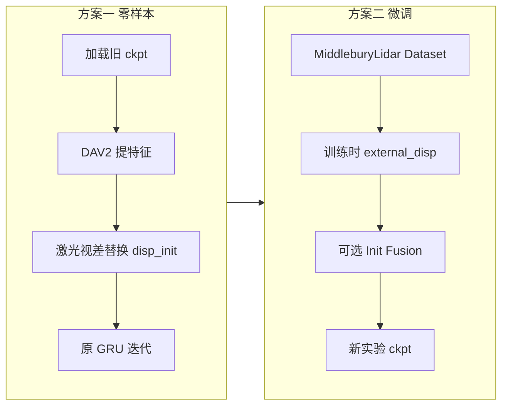

# 仿真激光雷达视差接入 DEFOM-Stereo 设计说明

本文档说明如何将 Middlebury 仿真激光雷达视差（见项目外 `export_disparity.py` 生成的 `disp0_lidar*.png`）接入 DEFOM-Stereo，在**复用现有 checkpoint** 的前提下，用激光视差替代 Depth Anything V2（DAV2）输出的初值视差，并经由原有迭代模块得到最终深度/视差。

配套数据格式与脚本说明见仓库外的 Middlebury 工具 README（`disp0_lidar.png`、`disp0_lidar_dense.png` 等）。

---

## 1. 当前管线：DAV2「视差」实际是什么

DEFOM 中 Depth Anything V2 **并不输出立体匹配意义上的真视差**，而是对**左图**预测的单目逆深度代理 `idepth`，再经归一化后作为**迭代优化的初始 `disp`**。

### 1.1 数据流（与 checkpoint 相关的部分）

```text
image1, image2
    → DefomEncoder (DepthAnythingV2)
         ├─ d_features, dfeat1, dfeat2  ← 仍走 DAV2，供 cnet / fnet / 相关体
         └─ idepth → 归一化 → disp_init    ← **仅此处**可被激光视差替换
    → CorrBlock1D + GRU 迭代 (scale_iters + update_iters)
    → disp_up（全分辨率）
```

### 1.2 关键代码位置

| 模块 | 文件 | 作用 |
|------|------|------|
| DAV2 前向 | `depth_anything_v2/dpt.py` | `depth_head` 输出 `idepth`（仅用左图 batch 前半） |
| 初值归一化 | `core/extractor.py` → `DefomEncoder.forward` | `idepth / max * idepth_scale * ow + 0.01` |
| 迭代入口 | `core/defom_stereo.py` → `DEFOMStereo.forward` | `disp` 进入 `CorrBlock1D` 与 GRU |

`DefomEncoder` 中初值计算（默认）：

```python
features, left_feat, right_feat, idepth = self.depth_anything(x, oh, ow)
max_idepth, _ = torch.max(idepth.view(bs, -1), dim=1)
idepth = idepth / max_idepth * self.idepth_scale * ow + 0.01
```

### 1.3 重要性质

| 项目 | 说明 |
|------|------|
| 工作分辨率 | 初始 `disp` 在 `(oh, ow) = (H / 2^nds, W / 2^nds)`，由 `get_danv2_io_size()` 决定，**不是全图分辨率** |
| DAV2 初值尺度 | 相对深度归一化后再乘 `idepth_scale * ow`，**不是像素视差** |
| 激光 PNG 编码 | `视差(像素) = uint16 / 256`，`0` 表示无效 |
| DEFOM 自带 PNG 读取 | `readDispMiddlebury` 对 PNG **未**做 `/256`，接入激光数据需专用 reader 或预处理 |
| 特征与初值 | `d_features` / `dfeat1` / `dfeat2` 与 `disp_init` **可解耦**——复用 checkpoint 的核心 |

### 1.4 推荐使用的激光视差文件

| 文件 | 特点 | 用途 |
|------|------|------|
| `disp0_lidar_dense.png` | 稀疏采样 + 深度域插值后的**全图稠密**视差（带噪） | **零样本 / 训练 init 首选** |
| `disp0_lidar.png` | 约 3.5% 像素有效，其余为 0 | 需空洞填充或 DAV2 回填后再作 init |
| `disp0_gt.png` / `disp0.pfm` | 真值 | 评估与训练监督，不作 init 替代 |

深度 PNG（`depth0_lidar_dense.png`）可在**最终结果**上用标定反投影；迭代本身在**视差空间**进行，建议 init 直接用 `disp0_lidar_dense.png`。

---

## 2. 方案一：旧 checkpoint 直接推理（不改权重）

### 2.1 设计原则

- **不修改** `state_dict` 结构与键名；`load_state_dict(..., strict=True)` 保持不变。
- **仅替换** 进入迭代循环前的 `disp` 张量。
- **保留** DAV2 完整前向，继续使用其 `d_features`、`dfeat1`、`dfeat2`；`depth_head` 的 `idepth` 可计算后丢弃。

### 2.2 结构改动（最小侵入）

```text
DefomEncoder.forward(..., external_disp=None)
    features, left_feat, right_feat, idepth = depth_anything(...)
    if external_disp is not None:
        disp_init = resize_align(external_disp)   # (B, 1, oh, ow)，像素视差
    else:
        disp_init = normalize(idepth)           # 原有逻辑

DEFOMStereo.forward(..., external_disp=None)
    ...
    disp = disp_init
    # 后续 scale_iters / update_iters 不变
```

建议新增（不涉及权重）：

1. **`core/utils/lidar_disp.py`**（或等价工具模块）
   - `read_lidar_disp_png(path)` → `(H, W)` float，`d = raw / 256.0`，`valid = raw > 0`
2. **`prepare_init_disp(disp_full, danv2_io_sizes, pad_meta)`**
   - 双线性缩放到 `(oh, ow)`
   - 与 `InputPadder` 对左右图的 padding **一致**
3. **CLI 扩展**（`demo.py` / `evaluate_stereo.py`）
   - `--init_disp_path` 或 `--init_disp_mode {dav2, lidar_dense, lidar_sparse}`

### 2.3 无效像素与尺度

激光视差为**像素单位**；DAV2 初值约在 `idepth_scale * ow` 量级。Middlebury 典型场景下，将激光视差下采样到 `(oh, ow)` 后可直接作为 `disp_init`，一般**不必**再做 `max-normalize`。

**无效区（`d == 0`）处理**（零样本可对比）：

| 策略 | 做法 | 说明 |
|------|------|------|
| A. DAV2 回填 | `disp = where(valid, lidar, dav2_init)` | 最稳，与旧 checkpoint 兼容性最好 |
| B. 插值填满 | 对稀疏图 inpainting 后再下采样 | 更贴近「仅有激光」部署 |
| C. 常数初值 | 无效区 `0.01` 或场景中值 | 仅作消融 |

若 EPE 系统性偏大/偏小，可对整图标量 `disp *= s`（`s ≈ 1`）微调，**不改动网络**。

### 2.4 推理流程

```text
im0, im1 + disp0_lidar_dense.png
    → 图像 pad（与现有 demo 一致）
    → DAV2 特征提取（checkpoint 不变）
    → disp_init = lidar @ (oh, ow)，无效区按策略 A/B 处理
    → 原有 DEFOM 迭代（iters / scale_iters 与评估脚本一致）
    → disp_final
    → 可选：Z = baseline × f / (d + doffs) 得深度 [mm]
```

### 2.5 预期与局限

**优势**

- 同一 `defomstereo_vitl_*.pth` 即可对比「DAV2 init」与「激光 init」。
- 稠密激光初值较准时，迭代更快，可适当减少 `scale_iters`。

**局限**

- GRU 在 KITTI / SceneFlow 等上学的是「从 DAV2 伪视差 refine」；激光插值带与训练分布不同，**特征仍来自 DAV2**，初值与特征可能略不匹配。
- PNG 必须 `/256` 解码，勿直接套用未修改的 `readDispMiddlebury` PNG 分支。

---

## 3. 方案二：复用 checkpoint 的微调

### 3.1 目标

在**冻结 DAV2 backbone / depth_head** 的前提下，让 `cnet`、`fnet`、`update_block`、`scale_update_block` 学会：**特征来自 DAV2，初值来自仿真激光**。

### 3.2 冻结与可训练参数

| 模块 | 建议 |
|------|------|
| `depth_anything.pretrained` | 冻结（与现训练一致） |
| `depth_anything.depth_head` | 冻结（init 不再使用其输出，但保留权重以便加载 ckpt） |
| `depth_feat` | 默认冻结；可按需解冻做消融 |
| `cnet`, `fnet`, `update_block`, `scale_update_block` | **训练** |

### 3.3 数据与训练接口

目录约定（每场景）：

```text
<Scene>-perfect/
  im0.png, im1.png
  disp0_lidar_dense.png    # 或 disp0_lidar.png + 在线 inpainting
  disp0_gt.png / disp0.pfm # 监督
  calib.txt                # 深度评估时使用
```

`__getitem__` 建议增加字段：

```python
{
    "img1", "img2",
    "disp_gt", "valid_gt",       # sequence_loss 监督
    "disp_lidar", "valid_lidar",  # 仅作 init，可不进入 loss
}
```

训练循环：

```python
disp_predictions = model(
    image1, image2,
    external_disp=prepare_init(disp_lidar, danv2_io_sizes, ...),
    iters=args.train_iters,
    scale_iters=args.scale_iters,
)
loss, metrics = sequence_loss(disp_predictions, disp_gt, valid_gt)
```

**数据增强对齐**：`disp_lidar` 与 `disp_gt` 必须经过同一 `SparseDispAugmentor`（crop、缩放、翻转），否则初值与监督几何不一致。

### 3.4 微调结构选项（由易到难）

#### 选项 A — 仅改初值来源（推荐首选）

- 与方案一相同注入 `external_disp`；训练全程使用激光 init，测试可选 `lidar` 或 `dav2`。
- 官方 DEFOM ckpt 全量加载；优化器只包含可训练参数。

**数据课程**：先 `lidar_dense`、低噪声 → 再引入 `--noise`、稀疏 `lidar`。

#### 选项 B — 可学习 Init Fusion（小模块）

在 `DefomEncoder` 增加（新参数，旧 ckpt `strict=False` 加载）：

```text
disp_init = σ(α) * disp_lidar + (1 - σ(α)) * disp_dav2
```

- `α`：1×1 conv 或轻量 CNN；无效区可用 mask 强制选用激光或 DAV2。
- 建议：先 freeze `α` 只训 GRU，再 joint 微调。

#### 选项 C — 新 `LidarInitHead` 替代 `depth_head` 输出

- 输入：左图 + 下采样激光；输出：残差 Δdisp。
- 改动大，旧 update 权重仍可用，但需新实验 ckpt；**不作为第一步**。

#### 选项 D — 在 `BasicMotionEncoder` 拼接激光通道

- 改变 `update_block` 输入维度，与旧 ckpt **不严格兼容**。
- 无激光推理泛化变差；仅作研究消融。

**推荐路径**：A →（必要时）B。

### 3.5 超参与损失

| 参数 | 建议 |
|------|------|
| 初始化权重 | `resume_ckpt` = 官方 `defomstereo_vitl_*.pth` 等 |
| `idepth_scale` | 使用激光 init 时初值不再走该缩放；CLI 可保留默认值 |
| `train_iters` / `scale_iters` | 与预训练相同或略减 `scale_iters` |
| 学习率 | 低于 from-scratch（例如 ×0.25），只更新可训练模块 |
| 主损失 | `sequence_loss` 对**最终** `disp_up`，与现训练一致 |
| 可选辅助项 | 在 `valid_lidar` 上小权重 `|disp_final - disp_lidar|`，防止偏离测量过远 |

### 3.6 稀疏激光（`disp0_lidar.png`）

训练：

1. **离线**：与 export 脚本一致，生成 `disp0_lidar_dense.png` 再训练（推荐）；或  
2. **在线**：DataLoader 内 inpainting，并对测量/插值区域区分监督（进阶）。

推理：若无 dense 文件，用方案一中的 B（插值）或 A（DAV2 回填）。

---

## 4. 深度与视差

- **迭代优化**：在视差空间（`core/defom_stereo.py` 中 `disp`）。
- **初值输入**：优先 `disp0_lidar_dense.png`，避免在增强后再从深度反算视差的额外误差。
- **最终深度**（评估或与 README 工具链一致）：

```text
Z [mm] = baseline × f / (d + doffs)
```

`f`、`baseline`、`doffs` 来自 `calib.txt`（与 Middlebury 文档一致）。

---

## 5. 实施顺序



1. 实现 `external_disp` 注入与 `/256` reader；用 `disp0_lidar_dense` 跑通 demo / evaluate，对比纯 DAV2 init。  
2. 在 Middlebury 子集上 `resume` 官方 ckpt，仅激光 init 微调 20k–50k step。  
3. 若初值–特征不匹配明显，再启用 **Init Fusion（选项 B）**。

---

## 6. 方案对比小结

| 维度 | 方案一：旧 ckpt 直接输出 | 方案二：微调 |
|------|-------------------------|--------------|
| 权重 | 完全不改 | 冻结 DAV2；训练 GRU（+ 可选 Fusion） |
| 代码改动 | `forward(external_disp=...)` + 加载工具 | 同左 + Dataset + 训练传参 |
| 激光角色 | 替换归一化后的 `disp_init` | 训练固定激光 init，学习 refine |
| DAV2 特征 | 保留 | 保留 |
| 最终输出 | 迭代视差 → 可选反投影深度 | 同上 |

**核心结论**：不必更换 Depth Anything V2 的 checkpoint；激光视差应作为 **RAFT 式迭代模块的初值** 注入，而不是替换整个 `DefomEncoder`。方案一可立即验证；方案二使更新块适应「激光初值 + DAV2 特征」的联合分布。

---

## 7. 已实现 / 待实现文件清单

| 文件 | 方案 | 状态 |
|------|------|------|
| `core/utils/lidar_disp.py` | 一、二 | 已实现 |
| `core/extractor.py` | 一、二 | 已实现 `external_disp` |
| `core/defom_stereo.py` | 一、二 | 已实现 `forward` 透传 |
| `evaluate_stereo_dense_lidar.py` | 一 | 已实现 Middlebury + LiDAR init 评估 |
| `core/stereo_datasets.py` | 二 | 待实现 `MiddleburyLidar` 训练集 |
| `demo.py` | 一 | 待扩展 CLI |
| `train_stereo.py` | 二 | 待从 batch 传入 `external_disp` |

### 方案一评估示例

```bash
# MiddEval3 / 2014 官方目录（每场景含 disp0_lidar_dense.png）
python evaluate_stereo_dense_lidar.py \
  --restore_ckpt checkpoints/defomstereo_vitl_middlebury.pth \
  --middlebury_root ./datasets/Middlebury \
  --split 2014 \
  --lidar_disp_name disp0_lidar_dense.png \
  --compare_dav2

# 扁平目录：dataset/Adirondack-perfect/im0.png + disp0_gt.png
python evaluate_stereo_dense_lidar.py \
  --restore_ckpt checkpoints/defomstereo_vitl_middlebury.pth \
  --middlebury_root ./dataset \
  --split custom \
  --gt_disp_name disp0_gt.png \
  --lidar_disp_name disp0_lidar_dense.png
```

---

## 8. 延伸阅读

- 仿真数据生成：Middlebury 工具 `export_disparity.py`、`disparity_to_pcd.py`（`README copy.md`）。
- 模型总览：`MODEL_ARCHITECTURE.md` 中 DefomEncoder 与迭代更新章节。
